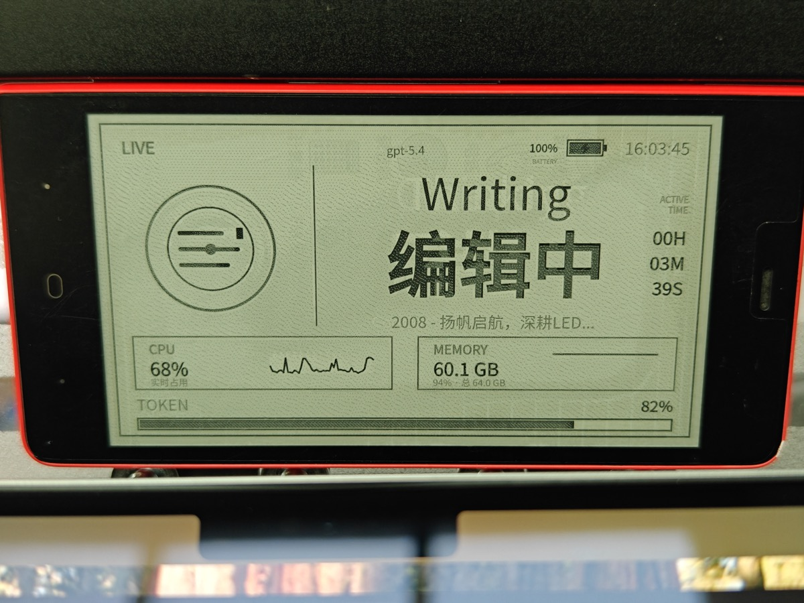
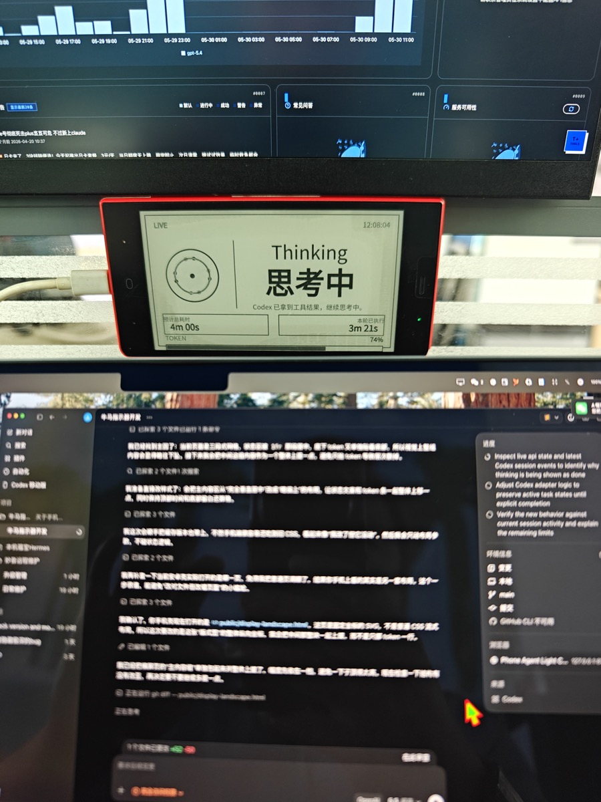
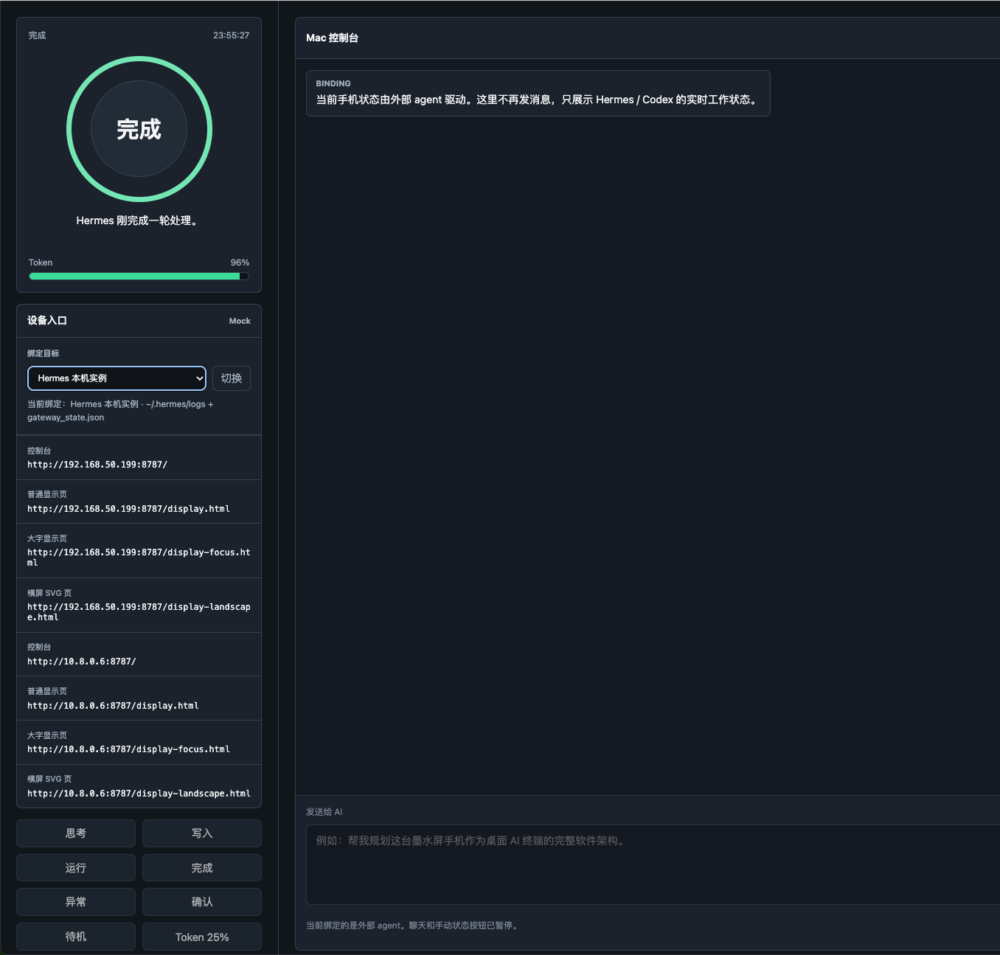
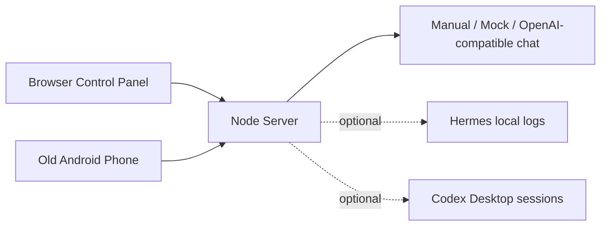

# Phone Agent Light

Turn an old Android phone into a lightweight always-on status display for local AI agents.

## Screenshots

### Phone display



### Portrait display



### Control panel



中文安装指南: [README.zh-CN.md](README.zh-CN.md)

Phone Agent Light runs a small Node.js server on your computer, serves a phone-friendly status page, and can optionally proxy a simple OpenAI-compatible chat flow. The phone only needs to open a web page, or you can install the included minimal Android WebView shell for a fullscreen experience.

## For Friends With a Mac and an Android Phone

The fastest path is browser mode. Build the Android APK only after the web page works.

```bash
git clone https://github.com/suvman195/phone-agent-light.git
cd phone-agent-light
npm run setup
npm start
```

`npm run setup` prints two addresses:

- Control panel: open this on the Mac
- Phone display page: open this on the Android phone

Both devices must be on the same Wi-Fi. If the phone page opens and shows the dashboard, the basic installation is done.

If the setup still feels confusing after reading this guide, try handing this repository to your AI coding agent and ask it to deploy the browser mode for you.

Optional fullscreen APK:

```bash
npm run android:build
```

Install the generated APK on the phone:

```text
android-shell/dist/phone-focus-shell.apk
```

## Features

- Old-phone friendly display pages, including a fixed-coordinate SVG landscape view
- Mac/browser control panel for manual state testing and chat
- Offline mock mode when no API key is configured
- Optional OpenAI-compatible API support through environment variables
- Optional local-agent status adapters for Hermes and Codex Desktop
- Minimal Android WebView shell with fullscreen, keep-screen-on, and boot receiver support
- No frontend build step and no runtime npm dependencies

## Architecture



Important files:

- `server.js`: HTTP API, static file server, state updates, and chat flow
- `lib/agent-bindings.js`: optional local-agent adapters and shared status mapping
- `public/index.html`: desktop control panel
- `public/display-landscape.html`: main phone landscape display
- `public/display.html` and `public/display-focus.html`: alternate display pages
- `android-shell/`: minimal Android WebView shell source
- `scripts/build-android-shell.sh`: Android shell build script
- `scripts/send-status.js`: CLI state updates
- `scripts/chat.js`: CLI chat helper

## Quick Start

### 1. Check your Mac

You need Node.js 18 or newer. Then run:

```bash
npm run doctor
```

This reports whether Node.js, `.env`, the optional Android build tools, and the local server are ready.

### 2. Configure environment

Create `.env` automatically:

```bash
npm run setup
```

Or copy the example file and edit values manually:

```bash
cp .env.example .env
```

The project works without an API key. If `OPENAI_API_KEY` is empty, it uses mock mode.

### 3. Start the server

```bash
npm start
```

Default URLs:

```text
Control panel: http://127.0.0.1:8787/
Phone page:    http://YOUR_COMPUTER_LAN_IP:8787/display-landscape.html
```

Put the phone and computer on the same Wi-Fi, then open the phone page in the phone browser.

### 4. Try manual status updates

```bash
npm run send -- THINKING
npm run send -- RUNNING
npm run send -- DONE
npm run send -- TOKEN:42
```

The CLI helpers read `AGENT_LIGHT_URL` from `.env` if you run the server on a different host or port.

### 5. Optional chat mode

Set an OpenAI-compatible key and model:

```bash
export OPENAI_API_KEY=your_api_key
export OPENAI_MODEL=gpt-4.1-mini
npm start
```

You can also set `OPENAI_BASE_URL` for compatible providers.

## Android WebView Shell

The Android shell is a tiny fullscreen WebView app. It is useful when you do not want browser address bars or tabs on the phone.

First run setup so `.env` contains the current phone URL:

```bash
npm run setup
```

Then build:

```bash
npm run android:build
```

You can also override the URL for one build:

```bash
SHELL_URL=http://YOUR_COMPUTER_LAN_IP:8787/display-landscape.html ./scripts/build-android-shell.sh
```

The APK is written to:

```text
android-shell/dist/phone-focus-shell.apk
```

Notes:

- `android-shell/dist/`, `android-shell/build/`, and signing files are ignored by git.
- The script expects Android command-line tools under `.android-sdk/`.
- The generated debug keystore is for local development only. Do not publish it.
- Browser mode does not need Android build tools. Use it first if APK building is not ready.

## Optional Local-Agent Bindings

Phone Agent Light can watch local agent activity, but these integrations read private files from your home directory. They are disabled by default.

Enable them explicitly:

```bash
ENABLE_HERMES_BINDING=1 ENABLE_CODEX_BINDING=1 npm start
```

Hermes adapter reads:

```text
~/.hermes/gateway_state.json
~/.hermes/logs/agent.log
~/.hermes/logs/gateway.log
```

Codex Desktop adapter reads:

```text
~/.codex/sessions/**/*.jsonl
```

These files may contain prompts, file paths, tool outputs, or other private information. Keep these adapters disabled unless you understand the privacy impact.

## HTTP API

- `GET /api/state`: current display state
- `GET /api/events`: Server-Sent Events stream
- `GET /api/bindings`: available binding targets
- `POST /api/bindings/select`: switch binding target
- `POST /api/state`: write state directly
- `POST /api/command`: write simple commands such as `THINKING` or `TOKEN:35`
- `GET /api/config`: local server config
- `GET /api/conversation`: in-memory conversation history
- `POST /api/chat`: start one chat turn
- `POST /api/conversation/reset`: clear conversation and return to `IDLE`

Example:

```bash
curl -X POST http://127.0.0.1:8787/api/chat \
  -H 'Content-Type: application/json' \
  -d '{"prompt":"Give me a short test checklist."}'
```

## Security and Privacy

This project is designed for trusted local networks.

- Do not expose the server directly to the public internet.
- Do not commit `.env`, API keys, logs, session files, APKs, keystores, SDK caches, or device screenshots.
- Local-agent bindings can read private logs and session JSONL files. They are opt-in for that reason.
- The API does not include authentication by default. Add a reverse proxy or access token before using it outside a trusted LAN.

## Repository Hygiene

The `.gitignore` intentionally excludes local build artifacts and private troubleshooting files. For public demos, place curated screenshots under `docs/` and make sure they do not include Wi-Fi names, local IPs, private prompts, device identifiers, or personal paths.

## License

MIT
